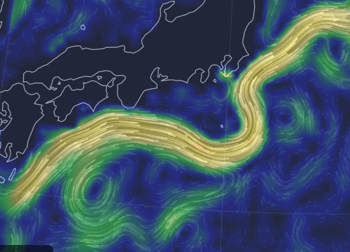

# Rearth
A R html-widget for visualization of global weather conditions or other spatial vector data. 

This project is based on a "localized" version of Cameron Beccario's "earth" project (https://github.com/cambecc/earth). You can run the "earth" visualization for your own data without the support of a web-server. The R package {htmlwidget} is used to wrap up the "earth" codes as a widget, and you can call it in just a few lines of R code. 

Installation
------------

``` r
devtools::install_github("Rmonsoon/Rearth")

```

Example
------------

``` r
library(Rearth)
setwd(system.file("external", package="Rearth"))

Rearth("orthographic=145,35,1800", mode="ocean", fn="ocean-currents.json")
```

Then the "Rearth" widget will be opened in your brower.




Another example for surface winds.

``` r
Rearth("orthographic=-90,40,1000", fn="surface-winds.json")
```


